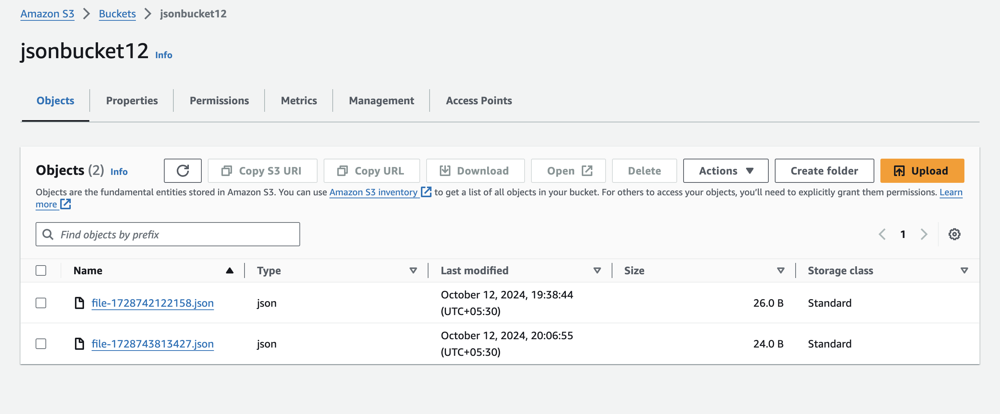

# JSON Data Storage and Retrieval Service

## Overview

This project involves creating a basic web service using AWS Lambda and API Gateway to allow users to store and retrieve JSON data in an S3 bucket. The service consists of two main API endpoints: a POST endpoint for storing JSON data and a GET endpoint for retrieving all stored JSON data.


## Features

- **POST Endpoint**: Allows users to store JSON data. Returns the ETag and the S3 URL of the stored file.
- **GET Endpoint**: Fetches all stored JSON files from the S3 bucket and returns a compiled list of their contents.

## Technologies Used

- **AWS Lambda**: For executing backend code without server management.
- **AWS API Gateway**: For creating, publishing, and managing APIs.
- **AWS S3**: For storing JSON files.

## Setup Instructions

1. **Create an S3 Bucket**:
   - Log in to the AWS Management Console.
   - Navigate to S3 and create a new bucket (e.g., `jsonbucket12`).
   - Ensure that the bucket is publicly accessible and has the necessary permissions for Lambda.

2. **Set Up AWS Lambda**:
   - Navigate to the AWS Lambda service in the console.
   - Create a new Lambda function.
   - Choose the runtime (Node.js 18.x).
   - Attach necessary permissions to the Lambda function to access the S3 bucket (e.g., `AmazonS3FullAccess`).

3. **Create API Gateway**:
   - Navigate to the API Gateway service.
   - Create a new REST API.
   - Define two resources: `/store` for the POST method and `/retrieve` for the GET method.
   - Link the POST method to the Lambda function created earlier.
   - Set up the GET method to fetch data from the Lambda function as well.

4. **Deploy the API**:
   - Deploy the API to a new or existing stage to generate an endpoint URL.

## API Endpoints

### POST /store

- **Description**: Stores JSON data sent from the client in the S3 bucket.
- **Request Body**: Must be valid JSON (e.g., `{"name": "John", "age": 30}`).
- **Response**:
  ```json
  {
      "e_tag": "a1b2c3d4e5f6g7h8i9j0",
      "url": "https://your-bucket.s3.amazonaws.com/file1.json"
  }

### GET /retrieve

- **Description**: Retrieves all stored JSON data from the S3 bucket.
- **Response**:
  [
    {"name": "John", "age": 30},
    {"name": "Jane", "age": 25}
  ]

### Error Handling

- **Invalid JSON Input**: The API checks for valid JSON and returns a 400 status code with a message if the input is invalid.
- **No Input Provided**: The API checks if the input is empty and returns a 400 status code.
- **S3 Access Issues**: Any errors during the storage or retrieval process are logged and a 500 status code is returned.

### Testing

Use tools like Postman to test the API endpoints.
For the POST endpoint, send various JSON payloads to verify that they are stored correctly.
For the GET endpoint, ensure all previously stored JSON data is retrieved accurately.

### Thought Process

- **Designing the Solution**: I began by outlining the requirements for storing and retrieving JSON data using AWS services. This involved understanding the roles of S3, Lambda, and API Gateway in building serverless applications.

- **Setting Up AWS Resources**: After creating the S3 bucket and configuring the necessary permissions, I focused on creating the Lambda function to handle the storage and retrieval of JSON data.

- **Implementing the API**: I defined the endpoints in API Gateway and linked them to the Lambda function. This involved handling different HTTP methods and ensuring proper request/response structures.

- **Error Handling and Testing**: I included error handling for invalid inputs and edge cases, ensuring that the API provides meaningful feedback to the user. Finally, I tested the endpoints to ensure functionality and reliability.

## Example Outputs

Here are some example outputs from the API:


*Example of a successful POST response.*


*Example of the data returned from the GET endpoint.*

## S3 Bucket Diagram


*Diagram showing the S3 bucket setup and interactions.*


### Conclusion

This project successfully demonstrates the ability to create a serverless web service using AWS technologies. It provides a practical implementation of storing and retrieving data in the cloud, along with considerations for error handling and API management.